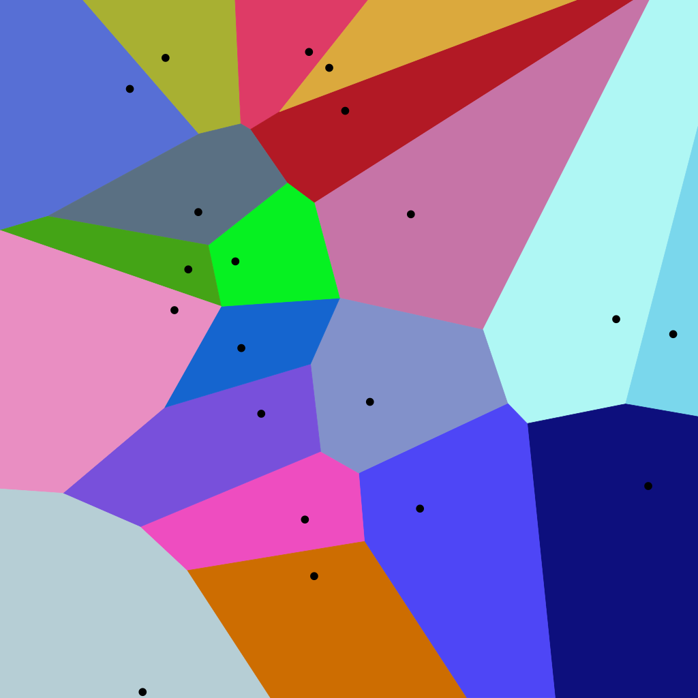
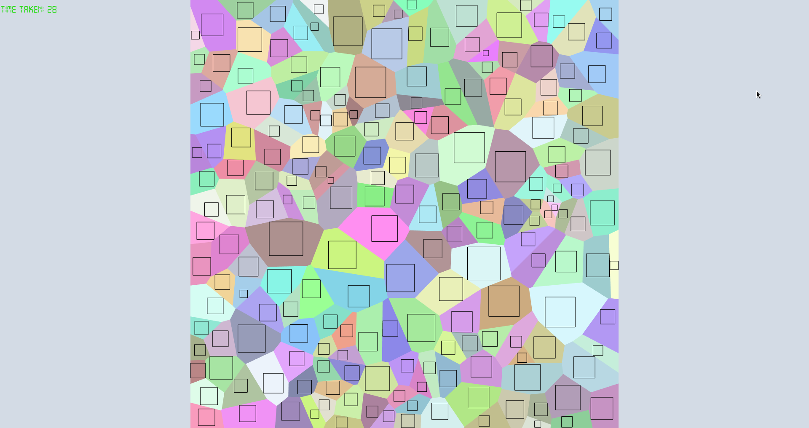
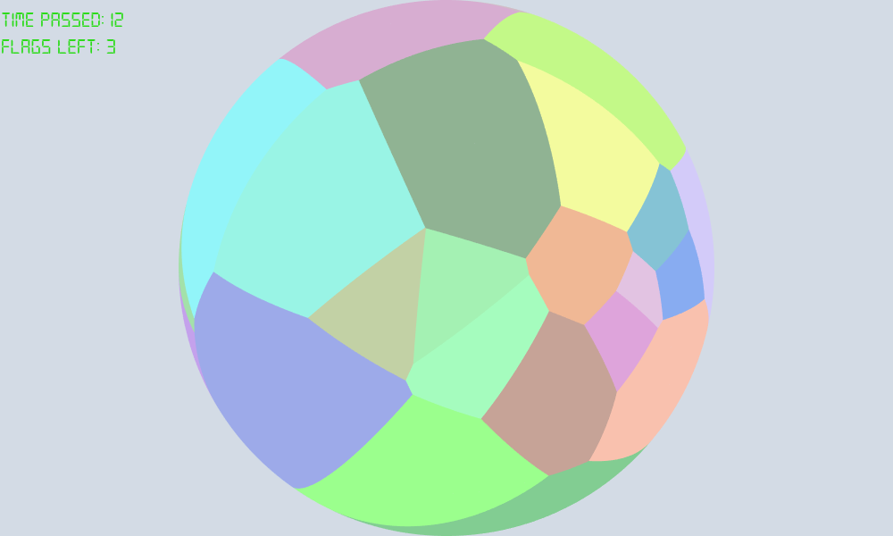
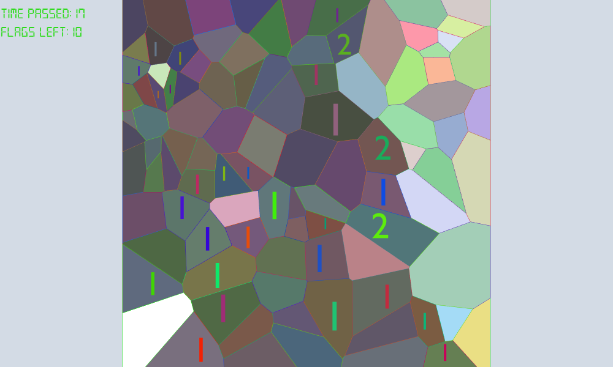
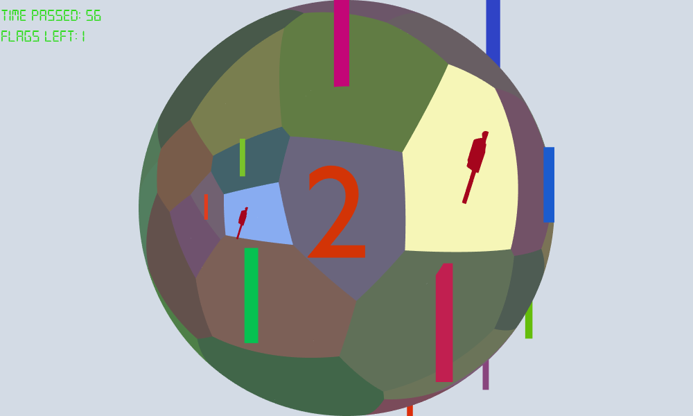

# Voronoi Minesweep

This project is initially a final project for NYU Computer Graphics class. The repository is forked from a private repository which was created for that project.

## How to play
Clone or fork this project, if you cloned this project to your local disk, remember to use --recursive to get every dependency for this project. You will need cmake to build and run this game.

After you got this project, make a build directory and cd to build, and type

``
cmake -DCMAKE_BUILD_TYPE=Release ../
``

Then make the project

``
make
``
And you should get the playble binary file

## The Idea 
*"Sometimes, the simplest ideas can be really hard to implement"* -- By myself

Voronoi diagram is a simple, but fascinating thing. 

*A Voronoi Diagram*

In each cell, the black points are what we called site point. A voronoi cell is generated so that every point inside the cell is closest to the site point contained in the cell. Although this property has nothing to do with the actual game, but it will be related to some functions of the game.

On the other hand, minesweep is a simple game where each cell either contain a number, representing the number of mines in its 9-neighbor, or a mine, or nothing. Player are supposed to put flags on the mine and open the rest of cells.

A voronoi minesweep game, ia almost the same as a regular minesweep game, but the grids you operate on will be a voronoi diagram.

## The Implementation
*"Nobody can escape from python"* -- By Xuan Tang

The first step of this project is to generate the voronoi diagram itself.

After exploring many packages in c++, I eventually turned to python for generating the graph. In python spatial library, there is already a method for generating the voronoi diagram given the site points. However, the boundary of the diagram is not really defined. How is is so? Because to the sites that are at the farmost positions, they really occupy any points that extends to infinity.

To solve that problem, there is a easy solution: we copy the points four times. Imagine all your site points are inside a box from (0, 0) to (1, 1), we simply reflect the points four times along its bounding edges. You will get a larger voronoi cell, but we only need to look at the cells inside the (0, 0) to (1, 1) bounding box, and since we are doing reflections, we can get the cell bounding points that are on the four edges of the bounding box instead of having them extended to infinity.

Now that we have the bounding box for each cell, we need to orient them so that they are in counterclockwise. Why is that? Turns out if the edges are not in that order, and we use triangle-fan to draw them, you just don't see it. I guess it might have something to do with the normal of the face, but I am not completely sure. Then, it is just like drawing a bunny, except that bunny is in a square and very flat.

In order to save time for searching where a mouse click lands, we introduce another data structure which works in the following way:

If there are n cells, we define m = n^(1/3), and thus we will cut the grid into m^2 square pieces. For each boundary point b, if it is in square piece s1, then we say anything cell that contains b as one of the boundary point is in square piece s1. This will decrease our seach time into O(logn).

However, there is a downside to this. There can be a cell whose boundary points falls into square piece s1, s2, ...., but the middle part of that is in a square piece sk. This means if we move the cursor to sk, we will not be able to determine which cell that is. We choose to ignore this exception because in the actual implementation, such probability is very rare. 

Although, there is an O(n) method to check that and does not involve any ray polygon intersection algorithm. We will talk about that method later.

Then we need a couple of maps to store the neighbors, and the number of mines around the neighbor. This is quite easy so I won't put too much detail about it.

Then comes to the first challenge: how large should the number/mine/flag be inside a cell?

Here is the method I implemented:
1. For each cell, get the center
2. Shoot a ray of degree 45, 135, 225, 315
3. Check intersection with the cell boundaries, get the smallest intersection with length j
4. Draw square with half the diagnal of length j

The result is as following:

Then we can determine the position and size of number/mine/flag inside this box

When it comes to the game play, after we determined which square piece our click is, we still need to determine which specific cell, so here comes the second challenge: how do you determine if a point is inside a polygon

Well it turns out there is a cheat to it:
1. Creat a line segment, starting from the center of the cell, to the clicking point
2. Determine if there is intersection between this line segment and any cell boundary
3. If there is no intersection, then the point is inside the polygon.

This is quite easy to implement, given that we have line intersection code, which is also very easy to implement.

And that basically concludes all for the voronoi minesweep.

## The Extra Part
*"When you are free of assignments and projects, you often wonder: is there anything else I can do, such is human nature"* -- By a guy who finished the project two weeks before the demo and just feel like he wanted more

So initially, I wrote in the project proposal: I think I can do a cubic voronoi minesweep. But then one day, it occurred to me: Cubic is kind of easy, just 6 sides and some extra maps, why not do a spherical voronoi minesweep? So here it is:

Again, to generate the cell spherical boundary points (each boundary point is on the sphere), but what do we do next? Those cells, if we just draw it, does not resemble a sphere at all, and gpu doesn't know much about circle or sphere, it only knows about line segments.

So here is the third challenge: Given a set of cells that makes a convex hull, how do you map it to a sphere?

Turns out there is no smart way of doing it. I mean, you can do a sphere and then do texture mapping, but you still got the sphere part to do.

So here is the method:
1. For each cell, connect the center with each side to form n triangles, where n is the number of edges defining the cell
2. For each triangle, constantly form 4 triangles by connecting midpoints of each edge.
3. If all the sides of a triangle has length less than 0.01, terminate, return all the triangles
4. For each point in the representation of a vector, since we want to map it to the sphere with radius of 1 and center at 0, we just devide that vector by its own length.

Now we have a lot of triangles that assembles a triangle. In a way this is like De Casteljau Algorithm.

Now that we can construct a sphere out of triangles, we need to determine how large a number/mine/flag can be for each cell. This is a completly different problem.

Somehow I can never get the polar coordinate to work perfectly. If we can rotate by polar coordinates, then we can simply rotate to the plane z=1 and calculate it like we did for the normal grid.

However, we can give a pretty good upper bound for each cell:
1. Determine the center for each cell
2. For each edge of the cell, determine the distance from center to to edge
3. Find the smallest distance
4. Construct squares with half the diagonal length of that smallest distance

This is the fourth challenge, and again, the solution seems to be quite easy and trivial, but it was not that easy to come up with it.

Now comes the last problem: how do we determine if a click lands in a spherical cell.

Well there are couple ways to do it: we can create triangles inside cell and determine ray triangle intersection, we can find the contact point on the plane of the cell, and determine if that point is inside the polygon. All of them needs some kind of ray mesh intersection.

The thing is, if we keep thinking this as an ray intersection problem, we can never jump out of the box. As a matter of fact, we can use the property of voronoi diagram: every point inside a cell are guaranteed to be closest to its own site.

So here is the algorithm:
1. For each click, we will get x and y position. We calculate z = sqrt(1 - x^2 - y^2)
2. For each site, calculate distance from the site point
3. The site with minimum distance will be our target

Easy right? And this is very fast since it is just three lines of code. We can make it even faster by cutting cells by their polar coordinates. But it is unnecessary here honestly.

And with all these parts set up, everything else is just game logic.

## The Actual Game
*"Anything that can go wrong will go wrong, like clicking on a mine at the first move with probability of 1/300"* -- By the first tester of the game

At the beginning of the game, you will need to enter 'g' for a normal voronoi minesweep, or anything else for a spherical minesweep. Then, just enter the number of cells and number of mines.

The game play is the same as a normal minesweep game. 

A normal grid

A spherical grid

When you move your mouse on a grid, the grid will turn to gray and its neighbors will be highlighted. This is because it is very hard, especially on a large grid, which is which's neighbor.

To win the game, simply open all the cells that are not dangerous and flag the mines.

For spherical voronoi minesweep, you can drag the mouse to rotate the sphere

## Copyright and stuff
https://www.1001fonts.com/digital-7-font.html for font that was used for timer

https://free3d.com/3d-model/american-flag-v1--414401.html for flag

https://free3d.com/3d-model/boat-mine-v1--471727.html for mine

The number meshes are generated through blender by myself
